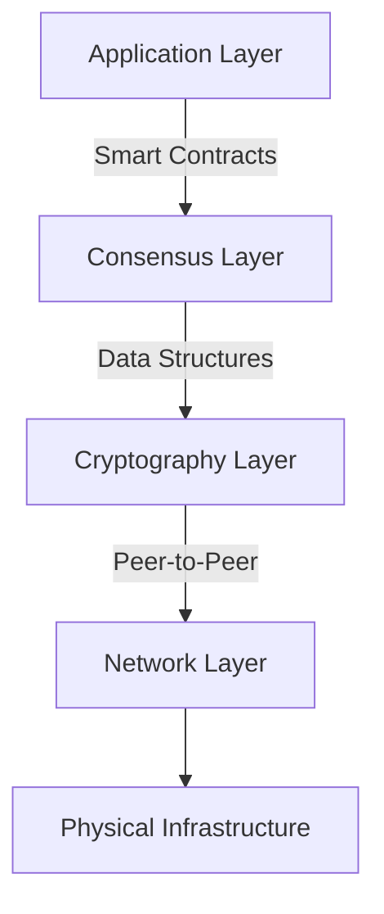
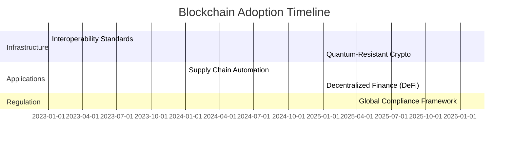

# Distributed Ledger Technology: Blockchain Fundamentals and Applications

## Understanding Blockchain Systems

**Blockchain technology** represents a paradigm shift in digital trust mechanisms, establishing a decentralized database maintained through cryptographic consensus. This revolutionary system eliminates traditional intermediaries, creating immutable records of transactions across peer-to-peer networks.

### Core Components of Blockchain

1. **Decentralized Architecture**: Nodes collectively maintain the ledger
2. **Cryptographic Security**: SHA-256 and elliptic curve algorithms protect data integrity
3. **Consensus Mechanisms**: Proof of Work, Proof of Stake, and PBFT ensure agreement
4. **Smart Contracts**: Self-executing agreements with predefined conditions

👉 [Explore blockchain applications in finance](https://bit.ly/okx-bonus)

## Evolution of Consensus Mechanisms

### Byzantine Fault Tolerance (1962)
Paul Baran's foundational work on distributed networks introduced cryptographic signatures that became essential for digital verification. The Byzantine Generals' Problem (1982) by Lamport et al. established mathematical frameworks for trust in distributed systems, proving systems remain reliable with ≥66% honest nodes.

### Modern Consensus Breakthroughs
| Consensus Type | Year | Key Features | Applications |
|----------------|------|--------------|--------------|
| Proof of Work (PoW) | 1999 | Energy-intensive mining | Bitcoin, Litecoin |
| Proof of Stake (PoS) | 2012 | Validator stakes as collateral | Ethereum 2.0, Cardano |
| Practical Byzantine Fault Tolerance (PBFT) | 1999 | High transaction finality | Hyperledger Fabric |
| Delegated PoS (DPoS) | 2014 | Elected validators | EOS, TRON |

### Emerging Innovations
- **Ripple Protocol (2012)**: Bank-grade consensus without mining
- **RAFT/Tangaroa (2014)**: Enhanced PBFT variants for enterprise use
- **Corda (2016)**: Privacy-focused DLT for financial institutions

## Industry Applications

### Financial Services Transformation
- **Cross-border Payments**: RippleNet reduces settlement times from days to seconds
- **Trade Finance**: Marco Polo Network automates documentary credits
- **Asset Tokenization**: Security Token Offerings (STOs) democratize investment access

### Healthcare Revolution
- **Medical Records**: Hashed patient data on Hyperledger Sawtooth
- **Clinical Trials**: Transparent data sharing across pharmaceutical companies

### Supply Chain Optimization
- **Provenance Tracking**: VeChain's NFC chips verify luxury goods authenticity
- **Inventory Management**: IBM Food Trust tracks produce from farm to shelf

👉 [Discover enterprise blockchain solutions](https://bit.ly/okx-bonus)

## Technical Architecture

### Layered Framework

### Data Structure Innovations
- **Merkle Trees**: Enable efficient transaction verification
- **Sharding**: Ethereum 2.0's solution for scalability
- **Zero-Knowledge Proofs**: Zcash's privacy-preserving technology

## Implementation Challenges

### Regulatory Landscape
- **Compliance Requirements**: GDPR data erasure conflicts with immutability
- **Interoperability Standards**: ISO/TC 307 working groups developing universal protocols
- **Taxation Frameworks**: Evolving global approaches to crypto asset taxation

### Technical Limitations
- **Scalability Trilemma**: Trade-offs between security, scalability, and decentralization
- **Energy Consumption**: Bitcoin's 110 terawatt-hour annual usage vs Ethereum's 0.01%
- **Quantum Threats**: Post-quantum cryptography research for lattice-based algorithms

## Future Outlook

### Emerging Trends
1. **Central Bank Digital Currencies (CBDCs)**: China's digital yuan pilot with 260 million users
2. **Web3 Integration**: Decentralized identity (DID) and data ownership
3. **AI Synergies**: Machine-to-machine transactions and autonomous contracts

### Adoption Roadmap

## Frequently Asked Questions

**Q: How does blockchain maintain security without central authorities?**  
A: Through cryptographic hashing, consensus algorithms, and distributed node validation. Each transaction receives multiple confirmations across geographically dispersed nodes.

**Q: Can blockchain systems scale for mass adoption?**  
A: Layer-2 solutions like Lightning Network and sharding architectures demonstrate potential for millions of transactions per second while maintaining decentralization.

**Q: What distinguishes public and private blockchains?**  
A: Public chains (Bitcoin, Ethereum) allow open participation, while private/consortium chains (Hyperledger, Corda) restrict access to approved entities with known identities.

**Q: How are smart contracts legally enforceable?**  
A: While varying by jurisdiction, many countries recognize smart contracts as binding agreements when meeting traditional contract requirements (offer, acceptance, consideration).

**Q: What environmental impact do blockchain networks have?**  
A: Energy consumption varies greatly: PoW networks consume significant energy, while PoS and DPoS mechanisms reduce usage by 99.95% or more.

## Implementation Framework

### Adoption Roadmap
1. **Use Case Identification**
   - Assess business processes requiring trust, auditability, or intermediaries
   - Prioritize high-volume, low-trust scenarios

2. **Platform Selection**
   - Public vs. private chain decision matrix
   - Regulatory compliance requirements
   - Performance benchmarks (TPS, latency)

3. **Integration Strategy**
   - Legacy system API gateways
   - Hybrid architecture with blockchain oracles
   - Data migration protocols

4. **Governance Model**
   - On-chain vs. off-chain governance
   - Permissioning and access control
   - Upgrade mechanisms and forking policies

5. **Security Framework**
   - Cryptographic key management
   - Multi-signature wallet implementation
   - Regular penetration testing

### Performance Metrics
| KPI | Target | Measurement Method |
|-----|--------|-------------------|
| Transaction Finality | <5 seconds | Average confirmation time |
| System Uptime | 99.999% | Node availability monitoring |
| Energy Efficiency | <0.01 kWh/tx | Total network consumption analysis |
| Data Throughput | 10,000+ TPS | Load testing under peak conditions |

### Cost-Benefit Analysis
- **Initial Investment**: Infrastructure, development, compliance
- **Operational Savings**: Reduced intermediation costs, automation efficiency
- **ROI Timeline**: 18-36 months for enterprise implementations
- **Risk Mitigation**: Fraud reduction, audit transparency, regulatory preparedness

👉 [Learn about blockchain security best practices](https://bit.ly/okx-bonus)